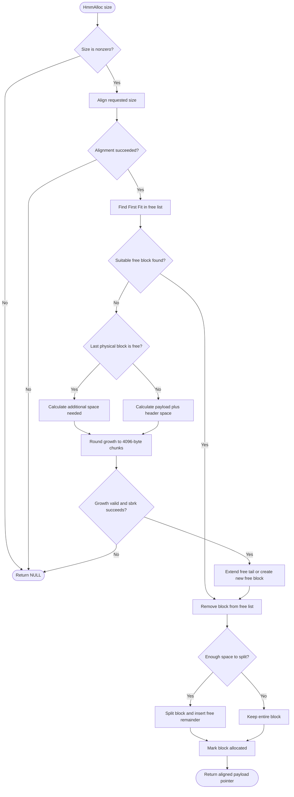
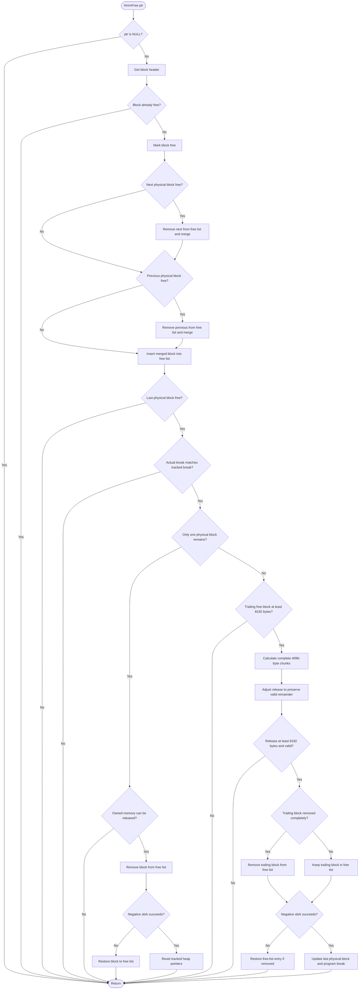

# Heap Memory Manager Flowcharts

## HmmAlloc() Flowchart

```mermaid
flowchart TD
    A([HmmAlloc size]) --> B{Size is nonzero?}
    B -- No --> Z([Return NULL])
    B -- Yes --> C[Align requested size]
    C --> D{Alignment succeeded?}
    D -- No --> Z
    D -- Yes --> E[Find First Fit in free list]
    E --> F{Suitable free block found?}
    F -- Yes --> M[Remove block from free list]
    F -- No --> G{Last physical block is free?}
    G -- Yes --> H[Calculate additional space needed]
    G -- No --> I[Calculate payload plus header space]
    H --> J[Round growth to 4096-byte chunks]
    I --> J
    J --> K{Growth valid and sbrk succeeds?}
    K -- No --> Z
    K -- Yes --> L[Extend free tail or create new free block]
    L --> M
    M --> N{Enough space to split?}
    N -- Yes --> O[Split block and insert free remainder]
    N -- No --> P[Keep entire block]
    O --> Q[Mark block allocated]
    P --> Q
    Q --> R([Return aligned payload pointer])
```

## HmmFree() Flowchart

```mermaid
flowchart TD
    A([HmmFree ptr]) --> B{ptr is NULL?}
    B -- Yes --> Z([Return])
    B -- No --> C[Get block header]
    C --> D{Block already free?}
    D -- Yes --> Z
    D -- No --> E[Mark block free]

    E --> F{Next physical block free?}
    F -- Yes --> G[Remove next from free list and merge]
    F -- No --> H{Previous physical block free?}
    G --> H

    H -- Yes --> I[Remove previous from free list and merge]
    H -- No --> J[Insert merged block into free list]
    I --> J

    J --> K{Last physical block free?}
    K -- No --> Z
    K -- Yes --> L{Actual break matches tracked break?}
    L -- No --> Z

    L -- Yes --> M{Only one physical block remains?}
    M -- Yes --> N{Owned memory can be released?}
    N -- No --> Z
    N -- Yes --> O[Remove block from free list]
    O --> P{Negative sbrk succeeds?}
    P -- No --> Q[Restore block to free list]
    Q --> Z
    P -- Yes --> R[Reset tracked heap pointers]
    R --> Z

    M -- No --> S{Trailing free block at least 8192 bytes?}
    S -- No --> Z
    S -- Yes --> T[Calculate complete 4096-byte chunks]
    T --> U[Adjust release to preserve valid remainder]
    U --> V{Release at least 8192 bytes and valid?}
    V -- No --> Z

    V -- Yes --> W{Trailing block removed completely?}
    W -- Yes --> X[Remove trailing block from free list]
    W -- No --> Y[Keep trailing block in free list]

    X --> AA{Negative sbrk succeeds?}
    Y --> AA
    AA -- No --> AB[Restore free-list entry if removed]
    AB --> Z
    AA -- Yes --> AC[Update last physical block and program break]
    AC --> Z
```

