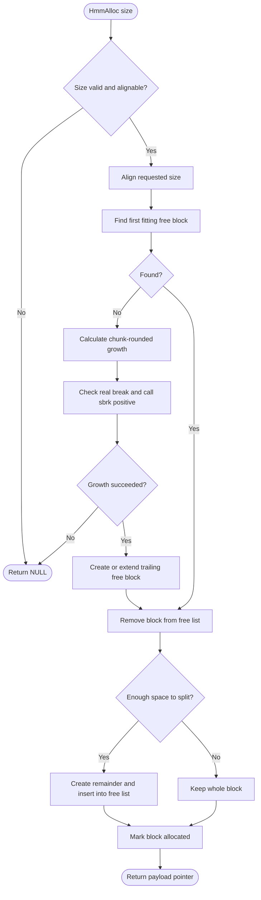
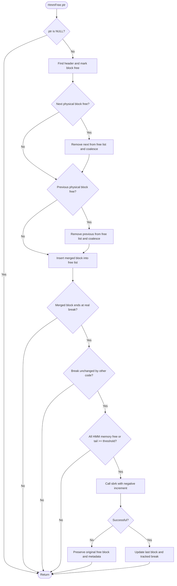

# Heap Memory Manager Flowcharts

## `HmmAlloc()` flowchart

```mermaid
flowchart TD
    A([HmmAlloc size]) --> B{Size valid and alignable?}
    B -- No --> X([Return NULL])
    B -- Yes --> C[Align requested size]
    C --> D[Find first fitting free block]
    D --> E{Found?}
    E -- No --> F[Calculate chunk-rounded growth]
    F --> G[Check real break and call sbrk positive]
    G --> H{Growth succeeded?}
    H -- No --> X
    H -- Yes --> I[Create or extend trailing free block]
    I --> J[Remove block from free list]
    E -- Yes --> J
    J --> K{Enough space to split?}
    K -- Yes --> L[Create remainder and insert into free list]
    K -- No --> M[Keep whole block]
    L --> N[Mark block allocated]
    M --> N
    N --> O([Return payload pointer])
```

## `HmmFree()` flowchart

```mermaid
flowchart TD
    A([HmmFree ptr]) --> B{ptr is NULL?}
    B -- Yes --> Z([Return])
    B -- No --> C[Find header and mark block free]
    C --> D{Next physical block free?}
    D -- Yes --> E[Remove next from free list and coalesce]
    D -- No --> F{Previous physical block free?}
    E --> F
    F -- Yes --> G[Remove previous from free list and coalesce]
    F -- No --> H[Insert merged block into free list]
    G --> H
    H --> I{Merged block ends at real break?}
    I -- No --> Z
    I -- Yes --> J{Break unchanged by other code?}
    J -- No --> Z
    J -- Yes --> K{All HMM memory free or tail >= threshold?}
    K -- No --> Z
    K -- Yes --> L[Call sbrk with negative increment]
    L --> M{Successful?}
    M -- No --> N[Preserve original free block and metadata]
    M -- Yes --> O[Update last block and tracked break]
    N --> Z
    O --> Z
```
